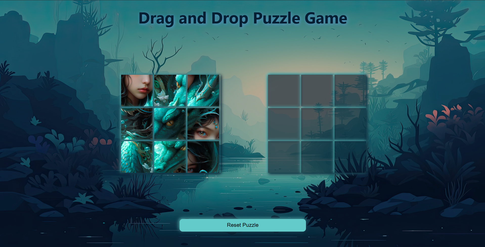

# Drag and Drop Puzzle Game

An interactive drag-and-drop puzzle where users arrange pieces to complete an image.

## About

This is a browser-based drag-and-drop puzzle game built using HTML, CSS, and JavaScript.  
Players drag puzzle pieces into the correct positions to complete the image.  
I built this project to practice the HTML Drag and Drop API, event handling, and building interactive user interfaces.

## Built With

`HTML` `CSS` `JavaScript` `Drag and Drop API`

## What I Learned

- How to implement drag-and-drop interactions and manage puzzle state using JavaScript.

## Links

- [Live Demo](https://snehashrestha123.github.io/Drag-and-Drop-Puzzle/ )
- [Source Code](https://github.com/Snehashrestha123/Drag-and-Drop-Puzzle)
